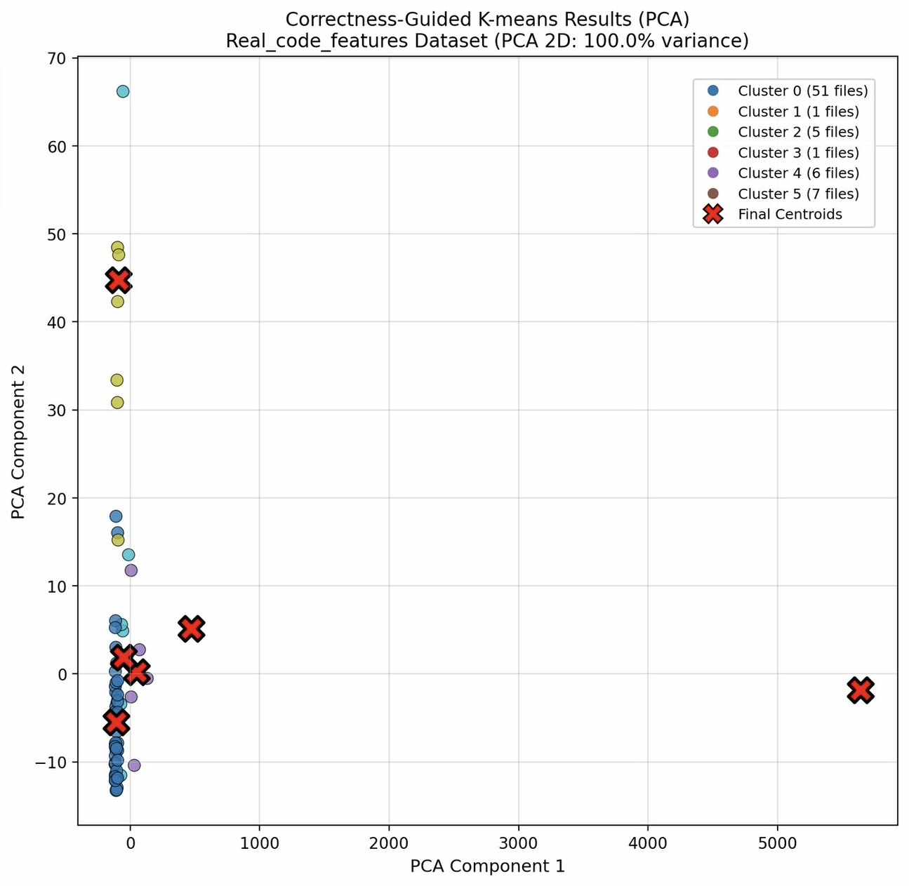

<!--
疑似コードのcss消したやつとっておき
border-left: 6px solid #95a5a6;
padding: 15px 25px; -->

<!-- _class: lead -->

<div class="title-center">

# プログラミング演習における誤答分類のための<br>構造的アプローチと意味的アプローチの比較評価

<div class="author-name">
山本研究室 2024831008 西村優基
</div>

</div>
</div>

---

## 背景：卒業研究からの継続課題

### 卒業研究

<div class="box">

<!-- **卒業研究のテーマ** -->

<div class = "grad">

- プログラミング演習問題の誤答に対して,<br>**Chat GPT(LLM)** が**教育的ヒント**を提案できるか検証

- **対象問題**: 競プロ典型90問(難易度★2)[1]
</div>

</div>

### 検証方法

<div class="grid-2col">

<div class="info-box-yellow">

<div class = "step1-left-title">

**Step 1: 誤答の収集と分類**

</div>
<div class = "step1-left">

各問題の実行できるが出力結果に問題がある<br>論理エラー(WA)の誤答を集計し,<br>**パターン分類**を実施

</div>

</div>

<div class="info-box-blue">

**Step 2: ヒント提案の検証**

<div class = "step1-left">

各パターンの代表的なコードに対し,<br>LLMが**教育的なヒント**を提案できるか確認
</div>

</div>

<div class="footer-note-small-first">
[1]競プロ典型90問,https://atcoder.jp/contests/typical90
</div>

</div>

---

## 研究背景：発見した課題

### 卒業研究で直面した問題

<div class="box">

**誤答の収集・パターン分類を手作業で実施**

1. 学習者の誤答コードを収集
2. どのような間違いか一つ一つ確認
3. 似た間違いをグループ化してパターンを作成
4. 各パターンに対して共通プロンプトを適用
</div>

→ **1問あたり1時間以上の作業時間**が必要で指導者の負担が大きい


---

## 本研究の目的
<!--
### 提案内容 -->

<div class="purpose">

  収集した誤答に対して,**機械的に分類する手法**を検討
</div>

### 期待される効果
<div class = "box">

-  パターン分類にかかる時間を**大幅削減**
-  指導者の**作業時間を効率化**

</div>

→ 手作業の効率化により,教育支援の**質と量**を向上

---

## ソースコードクラスタリングのアプローチ

既存のソースコードクラスタリングには主に**3つのアプローチ**が存在

| アプローチ | 特徴 | 主な課題 |
|:---:|:-----|:--------|
| **構造的** | トークン,ASTなど**構文的特徴**を抽出| フォーマット変更に敏感<br>動作や意味の考慮が不足|
| **意味的** | 構造ではなく,変数の使用,データの流れ<br>など**コードの中身**に着目 | すべてのデータペアを比較し階層を<br>作成するため**計算量が多い** |
| **行動的** | 実行時動作やDeep Learningを活用し,<br>記述形式に依存せず**動作で分類** | 大量データと前処理が必要で**労力が高い** |

---

## Asanas Cluster

<div class = "asanas-res">

先行研究では,構造的かつ意味的アプローチを組み合わせた<br>ソースコード自動分類ツール **Asanas Cluster** が提案されている [2]

</div>


<!--
### 概要 -->

<!-- <div class="box">
<div class = "asanas-exp">

ソースコードから **制御フローグラフ(CFG)** と **データフローグラフ(DFG)** を作成し,特徴量を抽出

→抽出した特徴量をもとにクラスタリングを実施する
</div>
</div> -->

<div class="footer-note-small">
[2] Paiva, J.C., Leal, J.P., and Figueira, Á., Clustering source code from automated assessment of programming assignments. </br>International Journal of Data Science and Analytics,  Volume 20, pages 1581–1592, (2025).
</div>

---

## Asanas Cluster

<div class = "asanas-res">

先行研究では,構造的かつ意味的アプローチを組み合わせた<br>ソースコード自動分類ツール **Asanas Cluster** が提案されている [2]

</div>


<!--
### 概要 -->

<!-- <div class="box">
<div class = "asanas-exp">

ソースコードから **制御フローグラフ(CFG)** と **データフローグラフ(DFG)** を作成し,特徴量を抽出

→抽出した特徴量をもとにクラスタリングを実施する
</div>
</div> -->

<div class="footer-note-small">
[2] Paiva, J.C., Leal, J.P., and Figueira, Á., Clustering source code from automated assessment of programming assignments. </br>International Journal of Data Science and Analytics,  Volume 20, pages 1581–1592, (2025).
</div>

---

## 制御フローグラフ と データフローグラフ

**Control Flow Graph (CFG)**: プログラム内の **「処理の流れ」** を表現したグラフ

<div class="box">

- **ノード**: 基本ブロック（命令のまとまり）
- **エッジ**: 制御の移動（if文の分岐,ループなど）

</div>

**Data Flow Graph (DFG)**: プログラム内の **「データの依存関係」** を表現したグラフ

<div class="box">

ある変数が**どこで定義**され,**どこで参照（使用）** されるかを追跡する

</div>

---

## 具体例(1/2)

### 整数のリストを受け取り,偶数をカウントする関数

```python
def count_evens(numbers):

    count = 0

    for n in numbers:

        if n % 2 == 0:

            count += 1

    return count
```

---

## 具体例(2/2)

<div class="grid-2col">

<div>

### 制御フローグラフ(CFG)

<div class = "margin-white"></div>


<div class = "margin-white"></div>


<div class = "box">

<div class = "step1-left">

プログラムの順序を**ノード**と**エッジ**で表現する

</div>

</div>

</div>

<div>

### データフローグラフ(DFG)

<div class="dfg-image-section">


<div class = "box">

<div class = "step1-left">

変数の**定義**と**使用**を追跡する
<!-- プログラムの順序を**ノード**と**エッジ**で表現する -->

</div>

</div>

</div>

</div>

</div>

---

## 抽出する特徴量（1/2）

ソースコードからCFGとDFGを作成し,計**11個の特徴量**を抽出

### CFGから抽出する6個の特徴量

| 特徴量 | 意味| 重み |
|:---|:---|:---|
| 連結成分の数 | 独立した処理ブロックの数（通常は1） | 1.0 |
| ループ文の数 | `for`,`while`,`再帰`が何個あるか | 1.0 |
| 条件分岐文の数 | `if`,`for`,`while`文が何個あるか | 1.0 |
| 閉路の数 | 繰り返し構造がいくつあるか | 1.0 |
| パスの数 | プログラムの実行経路が何通りあるか(分岐や閉路を一度のみ考慮する) | 1.0 |
| 複雑度 | プログラムの複雑さを示す指標<br>（複雑度 = エッジの数 - ノードの数 + 2*連結成分の数） | 1.0 |

---

## 抽出する特徴量（2/2）

### DFGから抽出する5つの特徴量

| 特徴量 | 意味| 重み |
|:---|:---|:---|
| 変数の数 | プログラムで使っている変数が何個あるか | 0.6 |
| 変数の読み込み総数 | 変数を読み取る操作が全体で何回あるか | 0.1 |
| 変数の書き込み総数 | 変数に値を書き込む操作が全体で何回あるか | 0.1 |
| 最大読み込み回数 | 最もよく読まれる変数は何回読まれているか | 0.1 |
| 最大書き込み回数 | 最もよく書き込まれる変数は何回書き込まれているか | 0.1 |

<div class="hint-box">

**具体例**: `x = a + b` → `a`と`b`を読み取り（参照）,`x`に書き込み（代入）

</div>

---

## 分類の仕組み
抽出した特徴量をもとに以下疑似コードによるクラスタリングアルゴリズムを実行
<div class="grid-7-3 classification-section">

<div>

### 疑似コード

<div class = "code">

```
Require: 2 <= k <= 16
Ensure: dist(c, S) は距離関数
Ensure: N はゼロ初期化配列
Ensure: C は k-means++ で初期化

repeat
    Let S be the new solution
    min, min_c ← ∞, 0
    for c ∈ C do
        d ← dist(c, S)
        if d <= min then
            min ← d
            min_c ← c
        end if
    end for
    N[min_c] ← N[min_c] + 1
    if S is correct then
        min_c ← min_c +
          (1/N[min_c]) × (S - min_c)
    end if
until no more submissions
```

</div>

</div>


</div>

---

## 分類の仕組み
抽出した特徴量をもとに以下疑似コードによるクラスタリングアルゴリズムを実行
<div class="grid-7-3 classification-section">

<div>

### 疑似コード

<div class = "code-1">

```
Require: 2 <= k <= 16
Ensure: dist(c, S) は距離関数
Ensure: N はゼロ初期化配列
Ensure: C は k-means++ で初期化

repeat
    Let S be the new solution
    min, min_c ← ∞, 0
    for c ∈ C do
        d ← dist(c, S)
        if d <= min then
            min ← d
            min_c ← c
        end if
    end for
    N[min_c] ← N[min_c] + 1
    if S is correct then
        min_c ← min_c +
          (1/N[min_c]) × (S - min_c)
    end if
until no more submissions
```

</div>

</div>

<div>

### ポイント

<div class="point-box">
<!-- <div class = "margin"></div> -->

クラスタ数: 2~16個
</div>

<div class="point-box">

距離関数はユークリッド距離を用いる
</div>

<div class="point-box">

初期配置をkmeans++にし,局所解防止
</div>

<div class="point-box">
データが一つ増えるたび重心を更新
</div>

<div class="point-box">

正解セントロイドを与え,正しい解の場合のみ
セントロイドを移動
</div>

</div>

</div>

</div>


---

## 実験手法

今回の実験では**2つの手法**を用いてどちらが高精度で分類できるか確認

<div class="grid-2col">

<div class="info-box-yellow">

### 手法1：Asanas Cluster

構造的・意味的アプローチ

**CFG**と**DFG**から特徴量を抽出し,<br>疑似コードによる分類

</div>

<div class="info-box-blue">

### 手法2：LLM
意味的・行動的アプローチ

LLMを用いた自然言語による誤答分類

</div>

</div>

---

## 手法2：LLMによる誤答分類

### 概要

<div class="box">

コードの**意味理解に長けたLLM(GPT-4o)** に,<br>**問題文**・**コード**・**分類カテゴリ**を与えて分類させる

</div>

<div class="grid-2col">

<div>

### 採用理由

<div class = "box">

- API経由での利用による**システム化**
- コードの意味理解が**高性能**
- モデルの進化により,<br>**コストパフォーマンスの向上**が期待

</div>

</div>

<div>

### プロンプト設計の工夫

<div class = "box">

- 与える問題文は**必要最低限の情報**のみ
- 間違いの**説明+カテゴリ番号のみ**出力
- カテゴリ名は間違い箇所ではなく,<br>**意味合い**を表すもの

</div>

</div>

</div>

---

## 手法2：プロンプト例

```
このコードの間違いを教えてください。
最後に以下のカテゴリのどれに当たるか数字のみ出力してください。
間違いの説明とカテゴリのみ出力してください。

【問題文（必要最低限の情報）】
...

【カテゴリ】
1. [カテゴリ1]
2. [カテゴリ2]
...
n. [カテゴリn]

【コード】
...
```

<div class="footer-note">
→ シンプルで明確な指示により,精度の高い分類を目指す
</div>


---

## 実験設定

### データセット

- **対象**: 競プロ典型90問（★2）の誤答(WA,またはTLE)
- **正解ラベル**: 手作業で問題ごとにカテゴリ分類
  - 例：「条件考慮漏れ」「全探索することでTLE」「差分の計算間違い」など

### 評価方法

<!-- <div class="grid-2col"> -->

<div>

**エラー指数**

<div class="error-index-section">

<div class="error-index-text">

1つのグループに異なる種類の誤答が<br>どれだけ混ざっているかを測定
（**0に近いほど良い**）

</div>

<!-- <div class = ""> -->
<div class="error-index-formula">

$$
\text{Error Index} = \frac{n_{\text{total}} - n_{\text{max}}}{n_{\text{total}}}
$$

<div class = "box">
<div class="small-text">

$n_{\text{total}}$: グループ内の誤答総数
$n_{\text{max}}$: 最多カテゴリの誤答数

</div>

</div>

</div>

</div>

</div>

<div>

<!-- **一致率**
<div class = "small-text">
正解との一致度を測定

自動分類の結果が,人間が分類した<br>正解とどれだけ一致しているか

→ 高いほど精度が良い -->

</div>

</div>

---

## 実験結果：全体の比較

### 各問題・各カテゴリにおけるエラー指数の比較

<div class="result-grid">

<div class="result-table">

| 問題 | カテゴリ | 手法1 | 手法2 |
|:---:|:---|:---:|:---:|
| **AA** | カテゴリ1 | 0.33 | 0.91 |
|  | カテゴリ2 | 0.50 | 0.57 |
|  | カテゴリ3 | 0.51 | 0.77 |
|  | カテゴリ4 | 0.00 | 0.35 |
|  | カテゴリ5 | 0.26 | 0.62 |
| **AG** | カテゴリ1 | 0.29 | 0.57 |
|  | カテゴリ2 | 0.97 | 0.98 |
| **BC** | カテゴリ1 | 0.00 | 0.33 |
|  | カテゴリ2 | 0.40 | 0.26 |
|  | カテゴリ3 | 0.00 | 0.27 |
|  | カテゴリ4 | 0.50 | 0.67 |
|  | カテゴリ5 | 0.76 | 0.67 |
| **BI** | カテゴリ1 | 0.82 | 0.65 |
|  | カテゴリ2 | 0.00 | 0.83 |
| **BO** | カテゴリ1 | 0.86 | 0.82 |
|  | カテゴリ2 | 0.00 | 0.36 |
|  | カテゴリ3 | 0.00 | 0.11 |
|  | カテゴリ4 | 0.19 | 0.00 |

</div>

<div class="result-table">

| 問題 | カテゴリ | 手法1 | 手法2 |
|:---:|:---|:---:|:---:|
| **BZ** | カテゴリ1 | 0.00 | 0.68 |
|  | カテゴリ2 | 0.63 | 0.00 |
|  | カテゴリ3 | 0.23 | 0.40 |
| **D** | カテゴリ1 | 0.00 | 0.33 |
|  | カテゴリ2 | 0.50 | 0.22 |
|  | カテゴリ3 | 0.56 | 0.44 |
|  | カテゴリ4 | 0.52 | 0.50 |
| **J** | カテゴリ1 | 0.00 | 0.33 |
|  | カテゴリ2 | 0.64 | 0.87 |
|  | カテゴリ3 | 0.13 | 0.83 |
|  | カテゴリ4 | 0.24 | 0.89 |
|  | カテゴリ5 | 0.00 | 0.44 |
| **V** | カテゴリ1 | 0.33 | 0.53 |
|  | カテゴリ2 | 0.00 | 0.58 |
|  | カテゴリ3 | 0.27 | 0.66 |
|  | カテゴリ4 | 0.67 | 0.83 |
| **X** | カテゴリ1 | 0.67 | 0.83 |
|  | カテゴリ2 | 0.07 | 0.71 |
|  | カテゴリ3 | 0.11 | 0.77 |

</div>

</div>

<div class="box">

→ LLMによる分類の方が**エラー指数が低く**,より正確な分類を実現

</div>

---

## 実験結果：手法1（Asanas Cluster）

### 問題例：典型90問- 010 Score Sum Queries

<div class="box">

**問題文**
N人の生徒が2クラスに分かれており、学籍番号i番のクラスCiと点数Piが入力される。
そこからQ個,LiとRiの入力を受け取り、それぞれについて以下を求める問題 [3]
- 学籍番号Lj~Rj番の1組生徒における、期末試験点数の合計
- 学籍番号Lj~Rj番の2組生徒における、期末試験点数の合計

</div>

### 間違いのカテゴリ

<div class="grid-2col">

<div class="small-text-asanas">

- **インデックス以外のクエリ処理での間違い**
- **クエリ処理時のインデックス処理での間違い**
- **累積和作成での間違い**

</div>

<div class="small-text-asanas">

- **累積和使っていない**
- **結果の計算間違い**

<div class="footer-note-small-asanas">
[3] 競プロ典型90問 , “010 - Score Sum Queries”, “https://atcoder.jp/contests/typical90/tasks/typical90_j” ​
</div>

</div>


</div>


---

## 実験結果：手法1（Asanas Cluster）

<div class="grid-2col">

<div>


**PCA可視化：クラスタリング前**


</div>

<div>

**PCA可視化：クラスタリング後**



</div>

</div>

<div class="warning-box">

- クラスタリング適用以前の可視化では,色が混在しており**明確な分類が難しい状態**

</div>

---

## 実験結果：手法1（静的解析）

<!-- ### なぜうまくいかなかったのか

静的解析は **コードの見た目（構造）** だけを見る → **間違いの意味** は分からない -->

### うまくいかなかった具体例：構造が似ているが意味が異なる誤答

<div class="grid-2col">

<div class="error-box">

**誤答A**
```python
cumsum = [0] * (n + 1)
for i in range(1, n + 1):
  cumsum[i] = cumsum[i - 1] + a[i - 1]

for i in range(n):  # 範囲不足
  for j in range(i, n):
    if cumsum[j + 1] - cumsum[i] > max_sum:
      max_sum = cumsum[j + 1] - cumsum[i]
```
→ **ループ範囲のミス**

</div>

<div class="error-box">

**誤答B**
```python
for i in range(n):
  for j in range(i, n):
    current_sum = 0
    for k in range(i, j + 1):
      current_sum += a[k]
    if current_sum > max_sum:
      max_sum = current_sum
```
→ **累積和を使わない非効率な計算**

</div>

</div>

どちらも「二重ループ + 条件分岐」という**類似した構造**を持つが,<br>**誤りの本質は全く異なる**ため,意味的要素を考慮しても構造的特徴では分類が困難

---

## 実験結果：手法2（LLM）- 成功例

### 問題例：典型90問-問題BC

<div class="box">

**問題文**

n個の整数から5個選び,それら整数の積をPで割るとQ余る組み合わせを求める問題[4]

</div>


### 間違いのカテゴリ

<div class="small-text">

- **全パターン探索によるTLE**
- **組み合わせの作成・選択ミス**: 選択する組み合わせに誤り
- **条件確認のミス**: 計算以外の条件確認に誤り
- **剰余計算のエラー**: 計算方法は正しいが,剰余計算部分で誤り
- **剰余計算以外の計算間違い**:例:整数ではなくインデックスで計算している
</div>

<div class="footer-note-small-second">
[4] 競プロ典型90問 , “055 - Select 5”, “https://atcoder.jp/contests/typical90/tasks/typical90_bc” ​
</div>

---

## 実験結果：手法2（LLM）- 成功例

<!-- ### コードの意味を理解した適切な分類 -->

LLMでは**コードの間違い箇所と意味合いを理解**し,カテゴリ分けに成功

<div class="grid-2col">

<div class="success-box-yellow">

**誤答A**
```python
for i in range(n-1):  # 範囲不足
    if a[i] > max:
        max = a[i]
```

**LLMの分類結果**
→ カテゴリ: **ループ範囲のミス**
</div>

<div class="success-box-teal">

**誤答B**
```python
for i in range(n):
    if a[i] >= max:  # 等号誤り
        max = a[i]
```

**LLMの分類結果**
→ カテゴリ: **条件判定のミス**
</div>

</div>

<div class="box">

- 構造は似ているが,**誤りの意味が異なる**コードを正しく別カテゴリに分類
- 文法的には正しいが**ロジックが誤っている**コードも適切に分類
</div>

---


## 実験結果：手法2（LLM）- 失敗例

### 問題例：典型90問-問題BC

<div class="box">

**問題文**

n個の整数から5個選び,それら整数の積をPで割るとQ余る組み合わせを求める問題[5]

</div>


### 間違いのカテゴリ

<div class="small-text">

- **全パターン探索によるTLE**
- **組み合わせの作成・選択ミス**: 選択する組み合わせに誤り
- **条件確認のミス**: 計算以外の条件確認に誤り
- **剰余計算のエラー**: 計算方法は正しいが,剰余計算部分で誤り
- **剰余計算以外の計算間違い**:例:整数ではなくインデックスで計算している
</div>

<div class="footer-note-small-second">
[5] 競プロ典型90問 , “055 - Select 5”, “https://atcoder.jp/contests/typical90/tasks/typical90_bc” ​
</div>

---

## 実験結果：手法2（LLM）- 失敗例

<!-- ### ハルシネーションによる誤分類 -->

Pythonライブラリを使用したコードに対して,**もっともらしい嘘**をつくケースが見られた

<div class="error-box">

**誤答コード例**
```python
import heapq
q = []
heapq.heappush(q, (cost, node))
# 実際の誤り: グラフ構造の定義ミス
```

**LLMの誤った分析**
「`heapq.heappush`の使い方が誤っています。第一引数は...」
→ **誤ったカテゴリ「ライブラリ使用ミス」へ分類**
</div>

<div class="warning-box">

- **ハルシネーション**により誤分類が発生する可能性がある

</div>

---

## 考察

### 静的解析の限界

<div class="compare-box-yellow">

・静的解析アプローチは,コードの **「構造」を捉える**のには適している
・教育的指導に必要な **「誤りの意味」を分類する**には情報が不足
・**特に初学者のコードは構造が多様**であり,構造的特徴だけで意味を同一視するのは困難

</div>

### LLMの優位性と課題

<div class="grid-2col">

<div class="compare-box-teal">

**優位性**

LLMは**コードの意味を理解**できるため,「誤答パターンの分類」において<br>静的解析より遥かに高い適性を持つ

</div>

<div class="warning-box">

**課題**

**ハルシネーション**による<br>誤った指摘のリスクが存在

→信頼性には注意が必要

</div>

</div>

---

## 結論

### 本研究の成果
<div class="box">

- **静的解析** : 構文的特徴に基づくため,**意味的な誤り分類には限界**がある

- **LLM** : コードの意味を理解し,**より正確な分類が可能**

</div>

<div class="conclusion-box">

**誤答分類の自動化**を目指す上では,<br>従来のような**特徴量ベースの静的解析手法**よりも,<br>**LLMを用いた意味的アプローチ**の方が有効である可能性が高い

</div>

---

## 今後の展望

**1. 静的解析とLLMのハイブリッド手法検討**
<div class="box">

   - 再現性と柔軟性,両者の長所を組み合わせた判定精度の向上
   - 誤答の性質に応じた最適な手法の選択

</div>

<!-- **2. Web API化によるシステム公開**

<!-- <div class="box"> -->
<!--
   - 開発した分類モデルを外部から利用可能な形で実装
   - 実際のプログラミング演習環境への導入とデータ収集 --> -->

<!-- </div> -->

**2. 卒業研究との統合**
<div class="box">

   - 卒業研究である「LLMによる教育的ヒント提案」への応用
   - 誤答の「分類」から「ヒント提案」までを一貫して行うシステムの実装
</div>

<!-- - **プロンプトの改良**: より正確な分類のための指示設計
- **多様な問題での検証**: 異なる難易度・問題タイプでの評価
- **ハルシネーション対策**: ライブラリ関連の誤分類を減らす工夫
- **実用化に向けた精度向上**: モデルの進化による性能改善
- **教育支援システムへの実装**: 卒業研究と組み合わせ分類からヒント提案まで自動化したシステムの構築 -->
</div>

<!-- <div class="footer-note-large">
→ 競技プログラミング教育の質と効率を向上させる基盤技術へ
</div> -->
