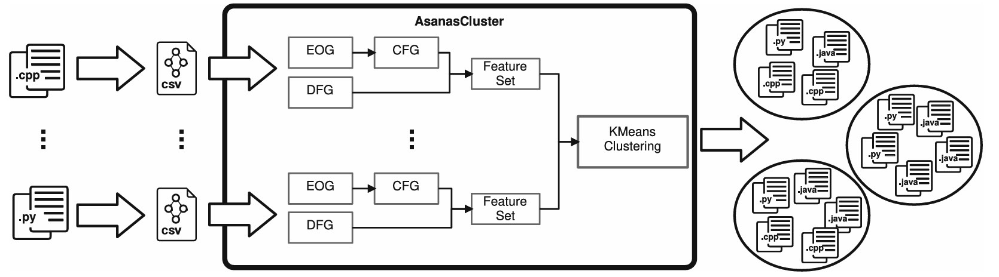
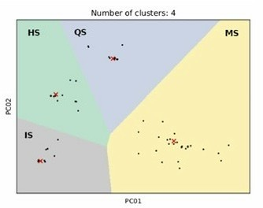
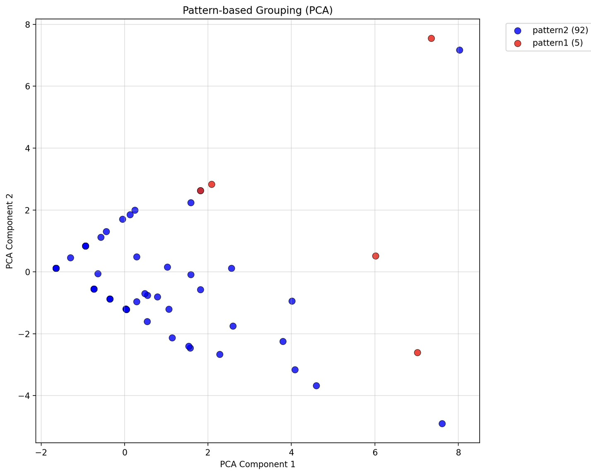
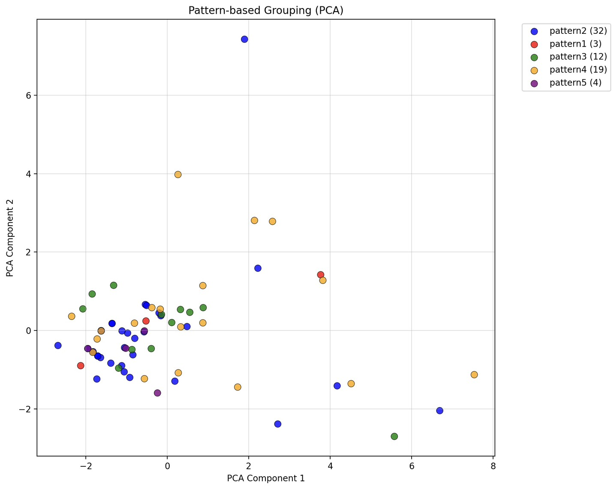

<!--
疑似コードのcss消したやつとっておき
border-left: 6px solid #95a5a6;
padding: 15px 25px; -->

<!-- _class: lead -->

<div class="title-center">

# プログラミング演習における誤答分類のための<br>構造的アプローチと意味的アプローチの比較評価

<div class="author-name">

山本研究室 2024831008 西村優基

</div>

</div>
</div>

---

## 目次

<div class="contents">

1. 背景と目的
2. 研究手法の選択
3. 先行研究：Asanas Cluster
4. 提案手法：LLM
5. 実験設定と結果
6. 考察
7. まとめ

</div>

---

<!-- _class: lead -->

<div class="title-center-middle">

## 1. 背景と目的

</div>

---

## 背景(1/2)

### 卒業研究

<div class="box">

<!-- **卒業研究のテーマ** -->

<div class = "grad">

- プログラミング演習問題の誤答に対して,<br>Chat GPT(LLM) が**教育的ヒント**を提案できるか検証

- 対象問題: 競プロ典型90問(難易度★2)[1]
</div>

</div>

### 検証方法

<div class="grid-2col">

<div class="info-box-yellow">

<div class = "step1-left-title">

Step 1: 誤答の収集と分類

</div>
<div class = "step1-left">

各問題の実行できるが出力結果に問題がある<br>論理エラー(WA)の誤答を集計し,<br>パターン分類を実施

</div>

</div>

<div class="info-box-blue">

Step 2: ヒント提案の検証

<div class = "step1-left">

各パターンの代表的なコードに対し,<br>LLMが**教育的なヒント**を提案できるか確認
</div>

</div>

<div class="footer-note-small-first">
[1]競プロ典型90問,https://atcoder.jp/contests/typical90
</div>

</div>

---

## 背景(2/2)

### 卒業研究で直面した問題

<div class="box">

誤答の収集・パターン分類を**手作業**で実施

1. 学習者の誤答コードを収集
2. どのような間違いか一つ一つ確認
3. 似た間違いをグループ化してパターンを作成
4. 各パターンに対して共通プロンプトを適用
</div>

→ 1問あたり1時間以上の作業時間が必要で指導者の**負担が大きい**


---

## 目的
<!--
### 提案内容 -->
<div class="purpose-all">

収集した誤答に対して,<span class="purpose">**機械的に分類する手法**</span>を検討
</div>

### 期待される効果
<div class = "box">

-  パターン分類にかかる時間を大幅削減
-  指導者の作業時間を効率化

</div>

→ 手作業の効率化により,教育支援の質と量を向上

---

<!-- _class: lead -->

<div class="title-center-middle">

## 2. 研究手法の選択

</div>

---

## 研究手法

今回の実験では**2つの手法**を用いて分類精度を比較検討

<div class="hint-box-small">

手法1は分類のみ,手法2は分類と説明が可能であり出力の性質は異なるが,<br>分類精度に焦点を当て比較することで,各アプローチの特性を明らかにする

</div>

<div class="grid-2col">

<div class="info-box-yellow">

### 手法1：Asanas Cluster

構造的・意味的アプローチ

CFGとDFGから特徴量を抽出し,<br>k-means法による分類

</div>

<div class="info-box-blue">

### 手法2：LLM
意味的・行動的アプローチ

LLMを用いた自然言語による誤答分類

</div>

</div>

---

<div class="title-center-middle">

## 3. 先行研究：Asanas Cluster

</div>

---

## 関連研究 : ソースコード分類のアプローチ

既存のソースコード分類には主に3つのアプローチが存在

| ジャンル | 特徴 | 主な課題 | アプローチ |
|:----:|:-----|:--------|:---:|
| 静的 | トークン,ASTなど構文的特徴を抽出| フォーマット変更に敏感<br>動作や意味の考慮が不足| 構造的 |
| 静的 | 構造ではなく,変数の使用,データの流れ<br>などコードの中身に着目 | すべてのデータペアを比較し<br>階層を作成するため計算量が多い | 意味的 |
| 動的 |実行時動作やDeep Learningを活用し,<br>記述形式に依存せず動作で分類 | 大量データと前処理が必要で<br>労力が高い | 動的 | 

<div class="box">

本研究では誤りの種類によりCFG・DFGに特有の構造的特徴が現れると期待し,<br>**構造的+意味的アプローチ**を採用
</div>

---

## 先行研究 : Asanas Cluster

<div class = "asanas-res">

先行研究では,構造的かつ意味的アプローチを組み合わせた<br>ソースコード自動分類ツール Asanas Cluster が提案されている [2]

</div>



<!--
### 概要 -->

<!-- <div class="box">
<div class = "asanas-exp">

ソースコードから **制御フローグラフ(CFG)** と **データフローグラフ(DFG)** を作成し,特徴量を抽出

→抽出した特徴量をもとにクラスタリングを実施する
</div>
</div> -->

<div class="footer-note-small">
[2] Paiva, J.C., Leal, J.P., and Figueira, Á., Clustering source code from automated assessment of programming assignments. </br>International Journal of Data Science and Analytics,  Volume 20, pages 1581–1592, (2025).
</div>

---

## 先行研究 : Asanas Cluster

<div class = "asanas-res">

先行研究では,構造的かつ意味的アプローチを組み合わせた<br>ソースコード自動分類ツール Asanas Cluster が提案されている [2]

</div>


<!--
### 概要 -->

<!-- <div class="box">
<div class = "asanas-exp">

ソースコードから **制御フローグラフ(CFG)** と **データフローグラフ(DFG)** を作成し,特徴量を抽出

→抽出した特徴量をもとにクラスタリングを実施する
</div>
</div> -->

<div class="footer-note-small">
[2] Paiva, J.C., Leal, J.P., and Figueira, Á., Clustering source code from automated assessment of programming assignments. </br>International Journal of Data Science and Analytics,  Volume 20, pages 1581–1592, (2025).
</div>

---

## 先行研究 : 制御フローグラフとデータフローグラフ

**Control Flow Graph (CFG)**: プログラム内の「処理の流れ」を表現したグラフ

<div class="box">

- ノード: 基本ブロック（命令のまとまり）
- エッジ: 制御の移動（if文の分岐,ループなど）

</div>

**Data Flow Graph (DFG)**: プログラム内の「データの依存関係」を表現したグラフ

<div class="box">

ある変数がどこで定義され,どこで参照（使用）されるかを追跡する

</div>

---

## 先行研究 : 具体例(1/3)

<div>

### 整数のリストを受け取り,偶数をカウントする関数

```python
def count_evens(numbers):

    count = 0

    for n in numbers:

        if n % 2 == 0:

            count += 1

    return count
```
</div>


---

## 先行研究 : 具体例(2/3)

<div class="grid-2col">

<div>

### 整数のリストを受け取り<br>偶数をカウントする関数

```python
def count_evens(numbers):

    count = 0

    for n in numbers:

        if n % 2 == 0:

            count += 1

    return count
```

</div>

<div>

### 制御フローグラフ(CFG)

<div class="powerpoint-space">

<!-- ここに図を挿入: CFGの図 -->

</div>

<div class = "box">

<div class = "step1-left">

プログラムの順序をノードとエッジで表現する

</div>

</div>

</div>

</div>

---

## 先行研究 : 具体例(3/3)

<div class="grid-2col">

<div>

### 整数のリストを受け取り<br>偶数をカウントする関数

```python
def count_evens(numbers):

    count = 0

    for n in numbers:

        if n % 2 == 0:

            count += 1

    return count
```

</div>

<div>

### データフローグラフ(DFG)

<div class="powerpoint-space">

<!-- ここに図を挿入: DFGの図 -->

</div>

<div class = "box">

<div class = "step1-left">

変数の定義と使用を追跡する

</div>

</div>

</div>

</div>

---

## 先行研究 : 抽出する特徴量（1/2）

ソースコードからCFGとDFGを作成し,計11個の特徴量を抽出

### CFGから抽出する6個の特徴量

| 特徴量 | 意味|
|:---|:---|
| 連結成分の数 | 独立した処理ブロックの数（通常は1） |
| ループ文の数 | `for`,`while`,`再帰`が何個あるか |
| 条件分岐文の数 | `if`,`for`,`while`文が何個あるか |
| 閉路の数 | 繰り返し構造がいくつあるか |
| パスの数 | プログラムの実行経路が何通りあるか(分岐や閉路を一度のみ考慮する) |
| 複雑度 | プログラムの複雑さを示す指標<br>（複雑度 = エッジの数 - ノードの数 + 2*連結成分の数） |

---

## 先行研究 : 抽出する特徴量（2/2）

### DFGから抽出する5つの特徴量

| 特徴量 | 意味|
|:---|:---|
| 変数の数 | プログラムで使っている変数が何個あるか |
| 変数の読み込み総数 | 変数を読み取る操作が全体で何回あるか |
| 変数の書き込み総数 | 変数に値を書き込む操作が全体で何回あるか |
| 最大読み込み回数 | 最もよく読まれる変数は何回読まれているか |
| 最大書き込み回数 | 最もよく書き込まれる変数は何回書き込まれているか |

<div class="hint-box">

具体例: `x = a + b` → `a`と`b`を読み取り（参照）,`x`に書き込み（代入）

</div>

---

## 先行研究 : 分類の仕組み(1/2)
抽出した特徴量をもとに**k-means法**で分類

<div class="box">

k-means法・・・データをk個のクラスタに分類する手法

各データを最も近い重心のグループに繰り返し割り当てることで,徐々にグループ分け

</div>


</div> -->

---

## 先行研究 : 分類の仕組み(2/2)
Asanas Clusterでは一般的なK-means法に工夫を加え,より正確な分類を実現

### ポイント

<div class="point-box">

- クラスタ数K: 2~16個

- 距離関数はユークリッド距離を用いる

- 初期配置をk-means++にし,局所解防止

- データが一つ増えるたび重心を更新

- 正解の重心を与え,正しい解の場合のみ重心を移動
</div>

---


## 先行研究 : Asanas Cluster

<div class = "asanas-res">

11個のの特徴量に対してk-means法を適用するとアルゴリズム戦略に基づいた分類が可能

</div>
<div class="grid-2col">
<div>


<div class="asanas-success-text">

深さ優先探索と幅優先探索

</div>

</div>

<div>



<div class="asanas-success-text">

ヒープ,マージ,挿入,クイックソート

</div>

</div>

</div>
<!--
### 概要 -->

<!-- <div class="box">
<div class = "asanas-exp">

ソースコードから **制御フローグラフ(CFG)** と **データフローグラフ(DFG)** を作成し,特徴量を抽出

→抽出した特徴量をもとにクラスタリングを実施する
</div>
</div> -->

<div class="footer-note-small">
[2] Paiva, J.C., Leal, J.P., and Figueira, Á., Clustering source code from automated assessment of programming assignments. </br>International Journal of Data Science and Analytics,  Volume 20, pages 1581–1592, (2025).
</div>


---

<!-- _class: lead -->

<div class="title-center-middle">

## 4. 提案手法 : LLM

</div>

---

## 研究手法(再喝)

今回の実験では**2つの手法**を用いて分類精度を比較検討

<div class="hint-box-small">

手法1は分類のみ,手法2は分類と説明が可能であり出力の性質は異なるが,<br>分類精度に焦点を当て比較することで,各アプローチの特性を明らかにする

</div>

<div class="grid-2col">

<div class="info-box-yellow">

### 手法1：Asanas Cluster

構造的・意味的アプローチ

CFGとDFGから特徴量を抽出し,<br>k-means法による分類

</div>

<div class="info-box-blue">

### 手法2：LLM
意味的・行動的アプローチ

LLMを用いた自然言語による誤答分類

</div>

</div>

---

## 手法2：LLMによる誤答分類

### 概要

<div class="box">

コードの意味理解に長けたLLM(**GPT-4o**) に,<br>問題文・コード・分類カテゴリを与えて分類させる

</div>

<div>

### GPT-4o採用理由

<div class = "box">

- 出力形式の安定性: 他LLMに比べ,フォーマット違反が少なくシステム化に適する[3]
- 分類精度の高さ: 分類タスクで高い適合率を示し教育現場での誤検知を抑制
- 速度とコスト: OpenAI o1等の推論特化型より高速でリアルタイム対応が可能

</div>

</div>

<div class="footer-note-small-result-bottom">

[3] OpenAI, "Introducing Structured Outputs in the API", "https://openai.com/index/introducing-structured-outputs-in-the-api/"

</div>

---

## 手法2：プロンプトについて

<div class="grid-7-3">

<div>

### プロンプトテンプレート


```
このコードの間違いを教えてください。
最後に以下のカテゴリのどれに当たるか数字のみ出力してください。
間違いの説明とカテゴリのみ出力してください。

【問題文（必要最低限の情報）】
...

【カテゴリ】
1. [カテゴリ1]
2. [カテゴリ2]
...
n. [カテゴリn]

【コード】
...
```

<div class="footer-note">
→ シンプルで明確な指示により,高精度な分類を目指す
</div>

</div>

<div>

### プロンプト設計の工夫

<div class = "box">

- 与える問題文は<br>必要最低限の情報のみ
- 間違いの説明+カテゴリ番号のみ出力
- カテゴリは個々の細かな誤りではなく、誤答の種類や<br>原因を具体的に示すもの

</div>

</div>

</div>


---

<!-- _class: lead -->

<div class="title-center-middle">

## 5. 実験設定と結果

</div>

---

## 実験設定

### データセット

- 対象: 競プロ典型90問（★2）の誤答(Wrong Answer,またはTime Limit Exceeded)
(難易度は★1～★7まで存在し、★1問題は存在しないため★2のみを対象）
- 正解ラベル: 手作業で問題ごとにカテゴリ分類
  - 例：「条件考慮漏れ」「全探索することでTLE」「差分の計算間違い」など

### 評価方法

<!-- <div class="grid-2col"> -->

<div>

**評価指標：F値 (F1-score)**

<div class="error-index-section">

<div class="error-index-text">

- ノイズと取りこぼしの少なさを<br>両立して評価
（1に近いほど良い）


</div>

<div class="error-index-formula">

$$
\text{F1} = 2 \times \frac{\text{Precision} \times \text{Recall}}{\text{Precision} + \text{Recall}}
$$

<div class = "box">
<div class="small-text">

$\text{Precision} = \text{正解数} / \text{分類した総数}$ （適合率）
$\text{Recall} \quad \ = \text{正解数} / \text{正解データの総数}$ （再現率）

</div>

</div>

</div>

</div>

</div>

</div>

---

## 実験結果：全体の比較

- 各問題・各カテゴリにおけるF値

<div class="result-grid">

<div class="result-table">

<table>
<tr><th>問題</th><th>カテゴリ</th><th>手法1</th><th>手法2</th></tr>
<tr><td rowspan="5">AA</td><td>カテゴリ1</td><td>0.40</td><td>0.91</td></tr>
<tr><td>カテゴリ2</td><td>0.50</td><td>0.57</td></tr>
<tr><td>カテゴリ3</td><td>0.36</td><td>0.77</td></tr>
<tr><td>カテゴリ4</td><td>0.00</td><td>0.35</td></tr>
<tr><td>カテゴリ5</td><td>0.53</td><td>0.62</td></tr>
<tr><td rowspan="2">AG</td><td>カテゴリ1</td><td>0.77</td><td>0.57</td></tr>
<tr><td>カテゴリ2</td><td>0.97</td><td>0.98</td></tr>
<tr><td rowspan="5">BC</td><td>カテゴリ1</td><td>0.00</td><td>0.33</td></tr>
<tr><td>カテゴリ2</td><td>0.46</td><td>0.26</td></tr>
<tr><td>カテゴリ3</td><td>0.17</td><td>0.27</td></tr>
<tr><td>カテゴリ4</td><td>0.44</td><td>0.67</td></tr>
<tr><td>カテゴリ5</td><td>0.77</td><td>0.67</td></tr>
<tr><td rowspan="2">BI</td><td>カテゴリ1</td><td>0.82</td><td>0.65</td></tr>
<tr><td>カテゴリ2</td><td>0.00</td><td>0.83</td></tr>
<tr><td rowspan="4">BO</td><td>カテゴリ1</td><td>0.67</td><td>0.82</td></tr>
<tr><td>カテゴリ2</td><td>0.10</td><td>0.36</td></tr>
<tr><td>カテゴリ3</td><td>0.00</td><td>0.11</td></tr>
<tr><td>カテゴリ4</td><td>0.13</td><td>0.00</td></tr>
</table>

</div>

<div class="result-table">

<table>
<tr><th>問題</th><th>カテゴリ</th><th>手法1</th><th>手法2</th></tr>
<tr><td rowspan="3">BZ</td><td>カテゴリ1</td><td>0.50</td><td>0.68</td></tr>
<tr><td>カテゴリ2</td><td>0.69</td><td>0.00</td></tr>
<tr><td>カテゴリ3</td><td>0.53</td><td>0.40</td></tr>
<tr><td rowspan="4">D</td><td>カテゴリ1</td><td>0.00</td><td>0.33</td></tr>
<tr><td>カテゴリ2</td><td>0.29</td><td>0.22</td></tr>
<tr><td>カテゴリ3</td><td>0.48</td><td>0.44</td></tr>
<tr><td>カテゴリ4</td><td>0.40</td><td>0.50</td></tr>
<tr><td rowspan="5">J</td><td>カテゴリ1</td><td>0.22</td><td>0.67</td></tr>
<tr><td>カテゴリ2</td><td>0.66</td><td>0.87</td></tr>
<tr><td>カテゴリ3</td><td>0.38</td><td>0.83</td></tr>
<tr><td>カテゴリ4</td><td>0.31</td><td>0.94</td></tr>
<tr><td>カテゴリ5</td><td>0.00</td><td>0.67</td></tr>
<tr><td rowspan="4">V</td><td>カテゴリ1</td><td>0.33</td><td>0.53</td></tr>
<tr><td>カテゴリ2</td><td>0.39</td><td>0.58</td></tr>
<tr><td>カテゴリ3</td><td>0.17</td><td>0.66</td></tr>
<tr><td>カテゴリ4</td><td>0.63</td><td>0.83</td></tr>
<tr><td rowspan="3">X</td><td>カテゴリ1</td><td>0.63</td><td>0.83</td></tr>
<tr><td>カテゴリ2</td><td>0.00</td><td>0.71</td></tr>
<tr><td>カテゴリ3</td><td>0.42</td><td>0.77</td></tr>
</table>

</div>

</div>

---

## 実験結果：全体の比較

- 各問題・各カテゴリにおけるF値

<div class="result-grid">

<div class="result-table">

<table>
<tr><th>問題</th><th>カテゴリ</th><th>手法1</th><th>手法2</th></tr>
<tr><td rowspan="5">AA</td><td>カテゴリ1</td><td>0.40</td><td>0.91</td></tr>
<tr><td>カテゴリ2</td><td>0.50</td><td>0.57</td></tr>
<tr><td>カテゴリ3</td><td>0.36</td><td>0.77</td></tr>
<tr><td>カテゴリ4</td><td>0.00</td><td>0.35</td></tr>
<tr><td>カテゴリ5</td><td>0.53</td><td>0.62</td></tr>
<tr><td rowspan="2">AG</td><td>カテゴリ1</td><td>0.77</td><td>0.57</td></tr>
<tr><td>カテゴリ2</td><td>0.97</td><td>0.98</td></tr>
<tr><td rowspan="5">BC</td><td>カテゴリ1</td><td>0.00</td><td>0.33</td></tr>
<tr><td>カテゴリ2</td><td>0.46</td><td>0.26</td></tr>
<tr><td>カテゴリ3</td><td>0.17</td><td>0.27</td></tr>
<tr><td>カテゴリ4</td><td>0.44</td><td>0.67</td></tr>
<tr><td>カテゴリ5</td><td>0.77</td><td>0.67</td></tr>
<tr><td rowspan="2">BI</td><td>カテゴリ1</td><td>0.82</td><td>0.65</td></tr>
<tr><td>カテゴリ2</td><td>0.00</td><td>0.83</td></tr>
<tr><td rowspan="4">BO</td><td>カテゴリ1</td><td>0.67</td><td>0.82</td></tr>
<tr><td>カテゴリ2</td><td>0.10</td><td>0.36</td></tr>
<tr><td>カテゴリ3</td><td>0.00</td><td>0.11</td></tr>
<tr><td>カテゴリ4</td><td>0.13</td><td>0.00</td></tr>
</table>

</div>

<div class="result-table">

<table>
<tr><th>問題</th><th>カテゴリ</th><th>手法1</th><th>手法2</th></tr>
<tr><td rowspan="3">BZ</td><td>カテゴリ1</td><td>0.50</td><td>0.68</td></tr>
<tr><td>カテゴリ2</td><td>0.69</td><td>0.00</td></tr>
<tr><td>カテゴリ3</td><td>0.53</td><td>0.40</td></tr>
<tr><td rowspan="4">D</td><td>カテゴリ1</td><td>0.00</td><td>0.33</td></tr>
<tr><td>カテゴリ2</td><td>0.29</td><td>0.22</td></tr>
<tr><td>カテゴリ3</td><td>0.48</td><td>0.44</td></tr>
<tr><td>カテゴリ4</td><td>0.40</td><td>0.50</td></tr>
<tr><td rowspan="5">J</td><td>カテゴリ1</td><td>0.22</td><td>0.67</td></tr>
<tr><td>カテゴリ2</td><td>0.66</td><td>0.87</td></tr>
<tr><td>カテゴリ3</td><td>0.38</td><td>0.83</td></tr>
<tr><td>カテゴリ4</td><td>0.31</td><td>0.94</td></tr>
<tr><td>カテゴリ5</td><td>0.00</td><td>0.67</td></tr>
<tr><td rowspan="4">V</td><td>カテゴリ1</td><td>0.33</td><td>0.53</td></tr>
<tr><td>カテゴリ2</td><td>0.39</td><td>0.58</td></tr>
<tr><td>カテゴリ3</td><td>0.17</td><td>0.66</td></tr>
<tr><td>カテゴリ4</td><td>0.63</td><td>0.83</td></tr>
<tr><td rowspan="3">X</td><td>カテゴリ1</td><td>0.63</td><td>0.83</td></tr>
<tr><td>カテゴリ2</td><td>0.00</td><td>0.71</td></tr>
<tr><td>カテゴリ3</td><td>0.42</td><td>0.77</td></tr>
</table>

</div>

</div>

---

<div class="title-center-middle">

## 6. 考察

</div>

<!--
このコードの間違いを教えてください。
最後に以下のカテゴリのどれに当たるか数字のみ出力してください。
間違いの説明とカテゴリの出力のみ出力してください。

イルミネーションがH*W個のLEDで構成されている
2*2の領域で2つ以上点灯していたらアウト
LEDの最大点灯個数を求める

1.探索し点灯個数をカウント
2.考慮漏れによる間違い -->

---
## 考察：手法1（Asanas Cluster）- 成功例

### 問題例：典型90問- 033 Not Too Bright

<div class="grid-2col">

<div class="box">

**問題文**
イルミネーションがH×W個のLEDで構成されている。
2×2の領域で2つ以上点灯してはいけない。
LEDの最大点灯個数を求める問題。[4]

</div>

<div class="success-box-teal">

**正解方法**
- 2×2制約 → 市松模様状に配置
- H=1 or W=1 → 全て点灯可能

```python
if H == 1 or W == 1:
    print(H * W)
else:
    print(((H+1)//2) * ((W+1)//2))
```

</div>

</div>

### 間違いのカテゴリ
<!--
- **探索し点灯個数をカウント**
- **考慮漏れによる間違い** -->

<div class="grid-2col">

<div class = "category-text-3">

- **探索し点灯個数をカウント**

</div>

<div class="category-text-3">

- **考慮漏れによる間違い**
</div>

</div>

<div class="footer-note-small-result-bottom">
[4] 競プロ典型90問 , “033 Not Too Bright”, “https://atcoder.jp/contests/typical90/tasks/typical90_ag"
</div>

---

## 考察：手法1（Asanas Cluster）- 成功例

<div class="grid-2col">

<div>


**PCA可視化：正解ラベルのプロット**



</div>

<div>

**PCA可視化：手法1によるクラスタリング**


</div>

</div>

<div class = "box-1">

<div class="grad">

- クラスタごとの色分布がはっきり分かれており、各クラスタが明確に可視化されている状態

</div>

</div>

---

## 考察：手法1（Asanas Cluster）- 成功例

### うまくいった具体例：アプローチが異なり構造も異なる誤答

<div class="grid-2col">

<div class="success-box-yellow">

**誤答A**
```python
def notTooBright(H: int, W: int) -> int:
    dp = [[False] * (W + 1) for _ in range(H + 1)]
    total = 0
    for r in range(1, H + 1):
        for c in range(1, W + 1):
            if not dp[r - 1][c - 1] and not dp[r - 1][c] and not dp[r][c - 1]:
                dp[r][c] = True
                total += 1
    return total
```
→ **探索し点灯個数をカウント**

</div>

<div class="success-box-teal">

**誤答B**
```python
h, w = map(int, input().split())

print(((h+1)//2) * ((w+1)//2))
```
→ **考慮漏れによる間違い**

</div>

</div>

<div class = "box">

<div class = "grad">

どちらも「点灯数を計算」という同じ目的を持つが,**アプローチが全く異なる**ため<br>構造も大きく異なり,構造的特徴によって適切に分類することができた

</div>

</div>


---
## 考察：手法1（Asanas Cluster）- 失敗例

### 問題例：典型90問- 010 Score Sum Queries

<div class="grid-2col">

<div class="box">

**問題文**
N人の生徒が2クラスに分かれており、学籍番号i番のクラスCiと点数Piが入力される。Q個のクエリでL~R番の各クラスの点数合計を求める。[5]

</div>

<div class="success-box-teal">

**正解方法**
- クラスごとに累積和を事前計算
- 各クエリにO(1)で回答

```python
# 区間[L,R]の合計
sum1[R] - sum1[L-1]  # 1組
sum2[R] - sum2[L-1]  # 2組
```

</div>

</div>

### 間違いのカテゴリ

<div class="grid-2col">

<div class = "category-text-2">

- **インデックス以外のクエリ処理での間違い**
- **クエリ処理時のインデックス処理での間違い**
- **累積和作成での間違い**

</div>

<div class="category-text-2">

- **累積和使っていない**
- **結果の計算間違い**

<div class="footer-note-small-result">
[5] 競プロ典型90問 , “010 - Score Sum Queries”, “https://atcoder.jp/contests/typical90/tasks/typical90_j” ​
</div>

</div>

</div>

---

## 考察：手法1（Asanas Cluster）  - 失敗例

<div class="grid-2col">

<div>


**PCA可視化：正解ラベルのプロット**



</div>

<div>

**PCA可視化：手法1によるクラスタリング**


</div>

</div>

<div class="warning-box">

- クラスタリング適用以前の可視化では,色が混在しており明確な分類が難しい状態

</div>

---

## 考察：手法1（Asanas Cluster） - 失敗例

<!-- ### なぜうまくいかなかったのか

静的解析は **コードの見た目（構造）** だけを見る → **間違いの意味** は分からない -->

### うまくいかなかった具体例：構造が似ているが意味が異なる誤答

<div class="grid-2col">

<div class="error-box">

**誤答A**
```python
cumsum = [0] * (n + 1)
for i in range(1, n + 1):
  cumsum[i] = cumsum[i - 1] + a[i - 1]

for i in range(n):  # 範囲不足
  for j in range(i, n):
    if cumsum[j + 1] - cumsum[i] > max_sum:
      max_sum = cumsum[j + 1] - cumsum[i]
```
→ **ループ範囲のミス**

</div>

<div class="error-box">

**誤答B**
```python
for i in range(n):
  for j in range(i, n):
    current_sum = 0
    for k in range(i, j + 1):
      current_sum += a[k]
    if current_sum > max_sum:
      max_sum = current_sum
```
→ **累積和を使わない非効率な計算**

</div>

</div>

<div class = "box">

<div class = "grad">

どちらも「二重ループ + 条件分岐」という類似した構造を持つが,<br>誤りの本質は全く異なるため,意味的要素を考慮しても構造的特徴では分類が困難

</div>

</div>


---

## 考察：手法2（LLM)- 成功例(再喝)

### 問題例：典型90問- 010 Score Sum Queries

<div class="grid-2col">

<div class="box">

**問題文**
N人の生徒が2クラスに分かれており、学籍番号i番のクラスCiと点数Piが入力される。Q個のクエリでL~R番の各クラスの点数合計を求める。[5]

</div>

<div class="success-box-teal">

**正解方法**
- クラスごとに累積和を事前計算
- 各クエリにO(1)で回答

```python
# 区間[L,R]の合計
sum1[R] - sum1[L-1]  # 1組
sum2[R] - sum2[L-1]  # 2組
```

</div>

</div>

### 間違いのカテゴリ

<div class="grid-2col">

<div class = "category-text-2">

- **インデックス以外のクエリ処理での間違い**
- **クエリ処理時のインデックス処理での間違い**
- **累積和作成での間違い**

</div>

<div class="category-text-2">

- **累積和使っていない**
- **結果の計算間違い**

<div class="footer-note-small-result">
[5] 競プロ典型90問 , “010 - Score Sum Queries”, “https://atcoder.jp/contests/typical90/tasks/typical90_j” ​
</div>

</div>

</div>

---

## 考察：手法2（LLM）- 成功例

<!-- ### コードの意味を理解した適切な分類 -->

LLMではコードの間違い箇所と意味合いを理解し,カテゴリ分けに成功

<div class="grid-2col">

<div class="success-box-yellow">

**誤答A**
```python
cumsum = [0] * (n + 1)
for i in range(1, n + 1):
  cumsum[i] = cumsum[i - 1] + a[i - 1]

for i in range(n):  # 範囲不足
  for j in range(i, n):
    if cumsum[j + 1] - cumsum[i] > max_sum:
      max_sum = cumsum[j + 1] - cumsum[i]
```
<div class = "asanas-res">

→ **ループ範囲のミス**
「**クエリ処理時のインデックス処理での間違い**」に分類

</div>

</div>

<div class="success-box-teal">

**誤答B**
```python
for i in range(n):
  for j in range(i, n):
    current_sum = 0
    for k in range(i, j + 1):
      current_sum += a[k]
    if current_sum > max_sum:
      max_sum = current_sum

```

<div class = "asanas-res">

→ **累積和を使わない非効率な計算**
「**累積和使っていない**」カテゴリに分類

</div>

</div>

</div>

<div class = "box-1">

<div class = "grad">

どちらも「二重ループ + 条件分岐」という類似した構造を持つが、LLMは誤りの意味や<br>ロジックの違いを正確に捉え、構造が似ていても本質的に異なる誤答を適切に別カテゴリへ分類

</div>

</div>

---


## 考察：手法2（LLM）- 失敗例

### 問題例：典型90問-022 Cubic Cake

<div class="grid-2col">

<div class="box">

**問題文**
幅A、高さB、奥行きCの直方体を切断して、最小何回で全ピースを立方体にできるか求める。[7]

</div>

<div class="success-box-teal">

**正解方法**
- 立方体の一辺 = GCD(A,B,C)
- 各辺の切断回数を合計

```python
g = gcd(gcd(A,B),C)
print(A//g + B//g + C//g - 3)
```

</div>

</div>

### 間違いのカテゴリ

<div class="grid-2col">

<div class = "category-text-2">

- **最大公約数算出間違い**
- **浮動小数点誤差による計算誤差**

</div>

<div class="category-text-2">

- **最大公約数を使用しない最小回数算出間違い**
- **最大公約数を使用した最小回数算出間違い**

</div>

</div>

<div class="footer-note-small-result-2">

[7] 競プロ典型90問 , “022 - Cubic Cake”, “https://atcoder.jp/contests/typical90/tasks/typical90_v”

</div>

</div>


---

## 考察：手法2（LLM）- 失敗例

<!-- ### ハルシネーションによる誤分類 -->

Pythonライブラリを使用したコードに対して,もっともらしい嘘をつくケースが見られた
<div class="error-box">

**誤答コード例**
```python
import math

A,B,C = map(int,input().split())
n = math.gcd(A,B,C)
print((A+B+C//n)-3)
# 実際の誤り: 演算子の優先度ミス
```

**LLMの誤った分析**
- 「`math.gcd`で3つの値の最大公約数を求めていますが、`gcd`は2つの引数のみサポートしています...」

→ **誤ったカテゴリ「最大公約数算出間違い」へ分類**

</div>

<div class="warning-box-hal">


ハルシネーションによる誤った分類のリスク


</div>

---

## 考察 : 総括

### 手法1（静的解析）の有効性と限界

<div class="compare-box-yellow">

・有効性: 全探索と数学的解法など,**アルゴリズムの方針自体が異なる**ものを明確に分離可能
・限界: ループ構造が同じ場合,インデックスのズレ等の局所的な誤りを識別できない

</div>

### 手法2（LLM）の有効性と課題

<div class="grid-2col">

<div class="compare-box-teal">

有効性

変数名や文脈から実装者の意図や<br>不可視の条件漏れを指摘できる

</div>

<div class="warning-box">

課題

- 複数バグの優先度判断が揺らぐ
- ハルシネーションによる<br>誤った指摘のリスクが存在

</div>

</div>

---

<!-- _class: lead -->

<div class="title-center-middle">

## 7. まとめ

</div>

---

## まとめ

### 本研究の成果
<div class="box">

- 静的解析 : アルゴリズムの方針が異なるものを高い信頼性で分類可能

- LLM : 構造に現れない文脈的な誤りを検出可能だが,判定は確率的

</div>

<div class="conclusion-box">

高精度な自動評価には,手法1による **「解法の大別」** を前提とし,<br>その上で手法2による **「論理の検証」** を行う階層的なアプローチが有効である
</div>

---

## 今後の展望

<div class = "after">

**1. 実行時間の考慮**
<div class="box">

- 今回の研究では分類精度を最優先したため、実行時間（計算コスト）を未考慮
- 実用化に向けて必要となる精度と実行時間のバランス評価
</div>

**2. カテゴリ数のみを与えた自動生成カテゴリによる検証**
<div class="box">

- 具体的な間違いカテゴリではなく、カテゴリ数のみを指定
  → LLMが自動でカテゴリを生成・分類する手法の検討
</div>

**3. 卒業研究との統合**

<div class="box">

- 誤答の「分類」から「ヒント提案」までを一貫して行う<br>システム実装による教育支援の自動化を実現
</div>

</div>
